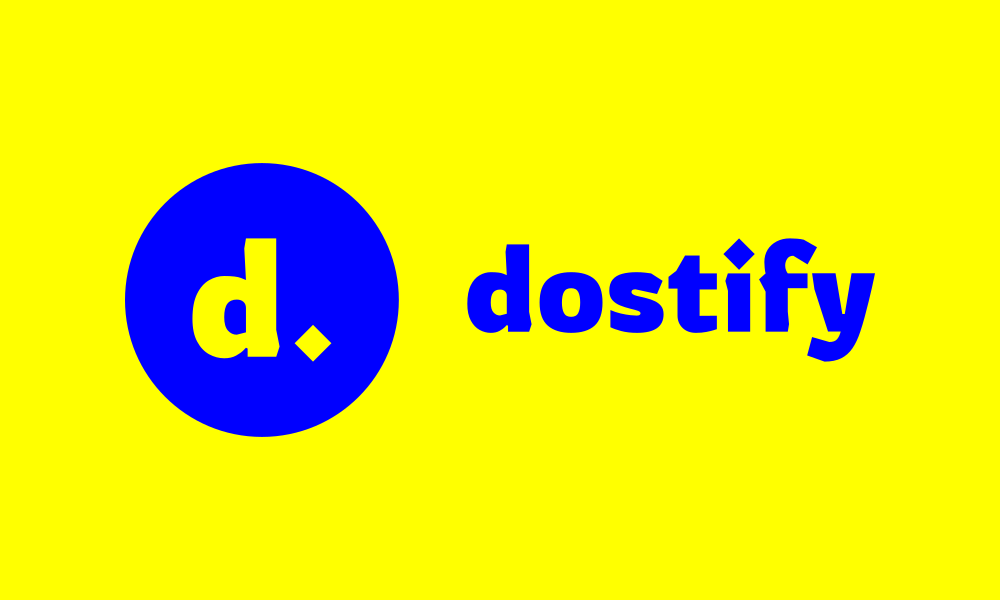
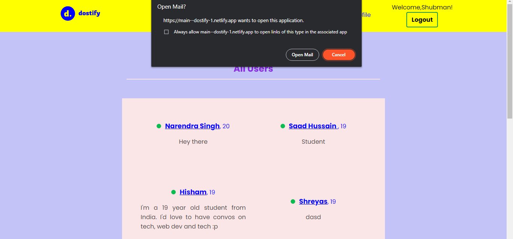
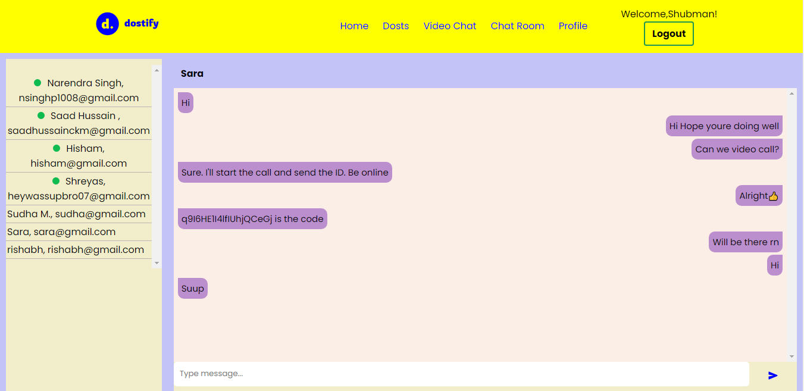
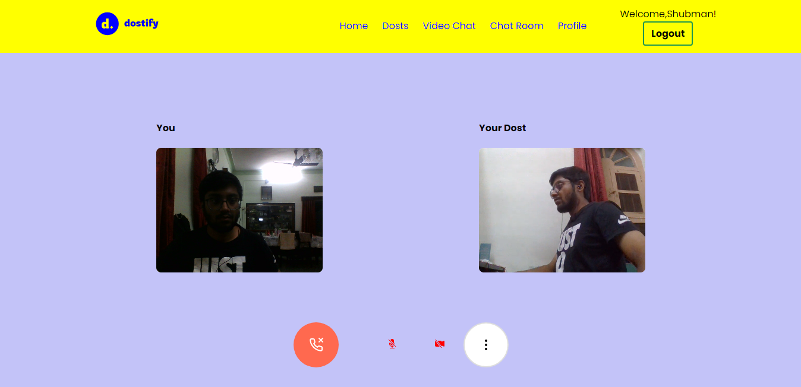

#  **_dostify: Make friends on the fly_** 

 

[🔗 Dostify: Vercel deployment](https://dostify.vercel.app/) 
[🔗 Dostify: Netlify deployment](https://main--dostify-1.netlify.app/)

 

A virtual meeting application which provides safe, secure and reliable virtual space for the users to meet!

Tools used: ReactJS, CSS, WebRTC APIs, and Firebase. Built with Vite.

 

#### _Steps to run this project:_

---

> git clone https://github.com/sikehish/dostify.git
>
> cd dostify
>
> npm init
>
> npm run dev

---

 

## **Why should you use dostify?**

<!-- --- -->

🤝 Befriend Like minded people  
🤝 Have one on one secure conversations with anyone.  
🤝 Chat with anyone over text using ChatRoom.

 

## **Our features**

<!-- --- -->

- **Dosts**

  
  You can view all the people registered onto the _dostify_ website who we also refer to as **dosts**. You can click on the name of any of the user and mail them personally based on their description. On clicking the name, by your permission you'd be redirected to the mail page where you can mail the _dost_.

 

- **Chat Room**

  
  You can chat with the dosts you want to make and so could anyone else, thereby enhancing your network and maybe your networth? 😉 Or you could have any conversation based on your interests? Or a potential life partner perhaps? 😉 **Everything is possible on this app, the options are limitless!**

 

- **Video Chat**

  
  You can have a video chat with the dosts you've made and enjoy the webRTC P2P connection!

---
